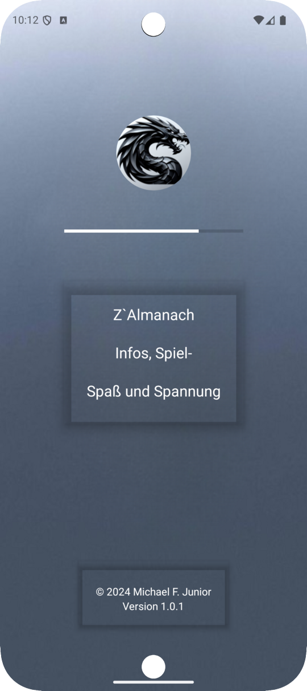
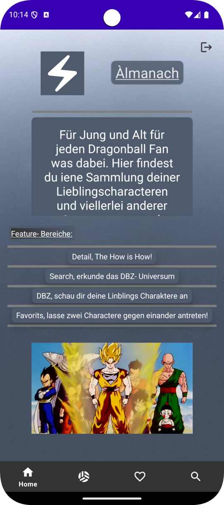
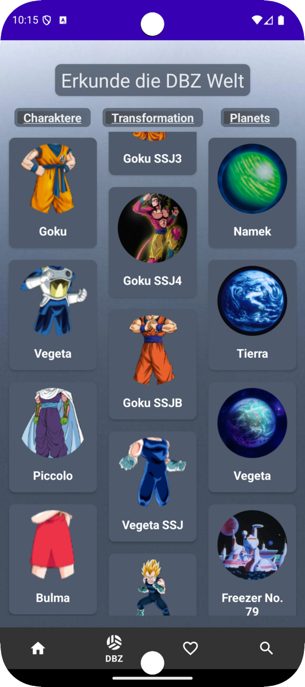
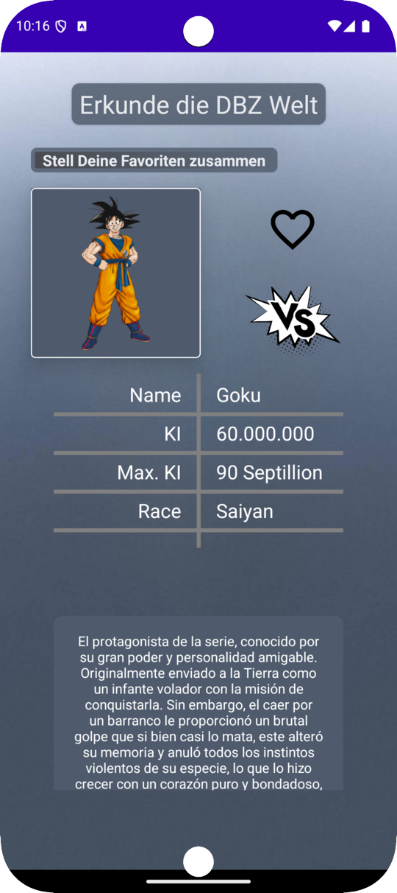
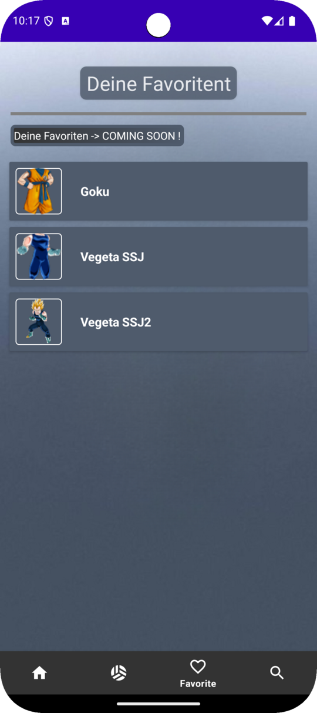
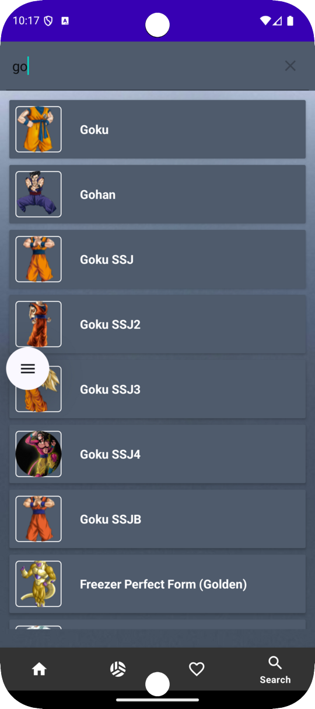
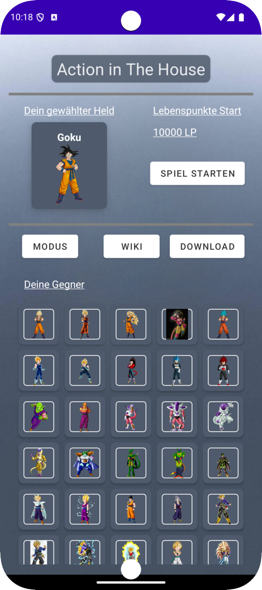

<div align="center">


# Z`Almanach

**Das Dragon Ball Z Almanach — Infos, Spiel-Spaß und Spannung**

Eine native Android-App rund um das Dragon-Ball-Z-Universum: durchstöbere Charaktere,
Transformationen und Planeten, lege Favoriten an, durchsuche das Universum in Echtzeit
und schicke deinen Helden in den Kampf.


</div>

---

## 📖 Über das Projekt

**Z`Almanach** ist meine Abschlussarbeit der Android-Entwicklungs-Ausbildung. Die App
demonstriert eine vollständige, sauber geschichtete Android-Anwendung nach dem
**MVVM-Muster**: Daten werden von einer REST-API ([dragonball-api.com](https://dragonball-api.com))
geladen, lokal mit **Room** zwischengespeichert und reaktiv über **ViewModel/LiveData**
an die UI gebunden. Bilder werden asynchron mit **Coil** nachgeladen, die Navigation
läuft über das **Jetpack Navigation Component** mit einer BottomNavigation.

> „Für Jung und Alt — für jeden Dragonball-Fan ist was dabei."

---

## 📱 Screenshots

<div align="center">

<table>
  <tr>
    <td width="25%" align="center" valign="top">
      
      <br><br>
      <strong>Splash</strong>
      <br>
      <sub>Logo & Intro</sub>
    </td>
    <td width="25%" align="center" valign="top">
      
      <br><br>
      <strong>Home</strong>
      <br>
      <sub>Begrüßung & Feature-Übersicht</sub>
    </td>
    <td width="25%" align="center" valign="top">
      
      <br><br>
      <strong>DBZ-Welt</strong>
      <br>
      <sub>Charaktere · Transformationen · Planeten</sub>
    </td>
    <td width="25%" align="center" valign="top">
      
      <br><br>
      <strong>Detail</strong>
      <br>
      <sub>Werte · Beschreibung · Favorit</sub>
    </td>
  </tr>
  <tr>
    <td width="25%" align="center" valign="top">
      
      <br><br>
      <strong>Favoriten</strong>
      <br>
      <sub>Gemerkte Charaktere</sub>
    </td>
    <td width="25%" align="center" valign="top">
      
      <br><br>
      <strong>Suche</strong>
      <br>
      <sub>Live-Filter über das Universum</sub>
    </td>
    <td width="25%" align="center" valign="top">
      
      <br><br>
      <strong>Spiel</strong>
      <br>
      <sub>Held wählen · Gegner antreten</sub>
    </td>
    <td width="25%" align="center" valign="middle">
      <br><br><br>
      <strong>Getestet auf</strong>
      <br>
      <sub>Android-Emulator<br>API 24–34</sub>
    </td>
  </tr>
</table>

</div>

---

## ✨ Features

- 🏠 **Home** — Einstieg mit Überblick über alle Feature-Bereiche der App
- 🐉 **DBZ-Welt erkunden** — drei parallele Listen für **Charaktere**, **Transformationen** und **Planeten**, befüllt aus der API
- 🔎 **Detailansicht** — Name, Kraftlevel (KI / Max. KI), Rasse und ausführliche Beschreibung pro Charakter
- ❤️ **Favoriten** — interessante Charaktere merken und in einer eigenen Liste wiederfinden
- 🔍 **Live-Suche** — durchsuche das gesamte Universum mit sofortiger Filterung während der Eingabe
- ⚔️ **Spiel-Modus** — wähle deinen Helden, setze die Lebenspunkte und tritt gegen ein Raster an Gegnern an
- 🖼️ **Asynchrones Bild-Laden** mit Coil & runden Avataren (CircleImageView)
- 💾 **Offline-Caching** der API-Daten über eine lokale Room-Datenbank

---

## 🛠️ Tech-Stack

| Bereich | Technologie |
|---|---|
| Sprache | **Kotlin** 1.9.0 |
| Architektur | **MVVM** (ViewModel · LiveData · Repository) |
| Netzwerk | **Retrofit 2** + **Moshi** (JSON) + OkHttp Logging-Interceptor |
| Lokale Daten | **Room** (Runtime/KTX, Compiler via **KSP**) |
| Bilder | **Coil** · **CircleImageView** |
| Navigation | **Jetpack Navigation Component** + **SafeArgs** + BottomNavigation |
| Nebenläufigkeit | **Kotlin Coroutines** |
| UI | Material Components · ConstraintLayout · **ViewBinding** · CardView |
| Build | Gradle 8.4 (Kotlin DSL) · AGP 8.x · Version Catalog (`libs.versions.toml`) |

**SDK:** `minSdk 24` · `targetSdk / compileSdk 34`

---

## 🏗️ Architektur

Die App folgt einer klaren Schichtentrennung nach **MVVM**:

```
UI (Fragment/Activity)  ──>  ViewModel  ──>  Repository  ──>  ┬─ Remote (Retrofit API)
   ViewBinding + LiveData     (LiveData)    (Single Source     └─ Local  (Room DB)
                                              of Truth)
```

**Paketstruktur** (`com.example.zalmanach`):

```
zalmanach/
├── ui/        # Activities & Fragments (Splash, Login, Home, Dbz, Detail, Favorite, Search, Play)
├── data/
│   ├── remote/  # Retrofit ApiService + DTOs (BASE_URL = dragonball-api.com/api/)
│   ├── local/   # Room Database + DAOs
│   └── model/   # Datenklassen / Entities
├── adapter/   # RecyclerView-Adapter
└── utils/     # Hilfsfunktionen
```

---

## 🌐 Datenquelle

Die Inhalte stammen aus der öffentlichen **[Dragon Ball API](https://dragonball-api.com)**
(`https://dragonball-api.com/api/`). Es wird **kein API-Key** benötigt — die App braucht
lediglich die Berechtigungen `INTERNET` und `ACCESS_NETWORK_STATE`.

---

## 🚀 Setup & Build

### Voraussetzungen
- Android Studio (Hedgehog/2023.1.1 oder neuer)
- JDK **17**
- Android SDK **34**

### In Android Studio
1. Repository klonen:
   ```bash
   git clone git@github.com:NEO849/ZAlmanach.git
   ```
2. Ordner in Android Studio öffnen (`File → Open`) und Gradle-Sync abwarten.
3. Auf einem Emulator oder Gerät (API 24+) ausführen (`Run ▶`).

### Über die Kommandozeile
```bash
cd ZAlmanach
./gradlew assembleDebug         # Debug-APK bauen
# Ergebnis: app/build/outputs/apk/debug/app-debug.apk
```

> Falls Gradle das SDK nicht findet, eine `local.properties` mit `sdk.dir=/pfad/zum/Android/Sdk` anlegen.

---

## 🗺️ Roadmap

- [ ] Favoriten-Persistenz vollständig ausbauen (aktuell teilweise „Coming Soon")
- [ ] Kampf-Logik des Spiel-Modus erweitern (Schadensberechnung, Runden)
- [ ] Mehrsprachige Beschreibungen (API liefert teils spanische Texte)

---

## 📜 Entwicklungsverlauf

Der vollständige, kommentierte Schritt-für-Schritt-Entwicklungsverlauf des Projekts
ist dokumentiert in **[docs/ENTWICKLUNGSVERLAUF.md](docs/ENTWICKLUNGSVERLAUF.md)**.

---

## 👤 Autor

**Michael F. Junior** — Abschlussprojekt der Android-Ausbildung (2024)

---

## 📄 Lizenz

Der **Quellcode** dieses Projekts steht unter der **MIT-Lizenz** — siehe [LICENSE](LICENSE).

Die MIT-Lizenz gilt ausschließlich für den selbst geschriebenen Code, **nicht** für die
eingebundenen Dragon-Ball-Z-Marken, -Namen, -Bilder und -Mediendateien (siehe Hinweis unten).

---

## ⚖️ Hinweis

Dies ist ein nicht-kommerzielles **Fan- und Lernprojekt**. *Dragon Ball Z* sowie alle
zugehörigen Namen, Charaktere und Bilder sind Eigentum ihrer jeweiligen Rechteinhaber
(Akira Toriyama / Shueisha / Toei Animation). Die Charakterdaten werden über die
öffentliche Dragon Ball API bereitgestellt.
